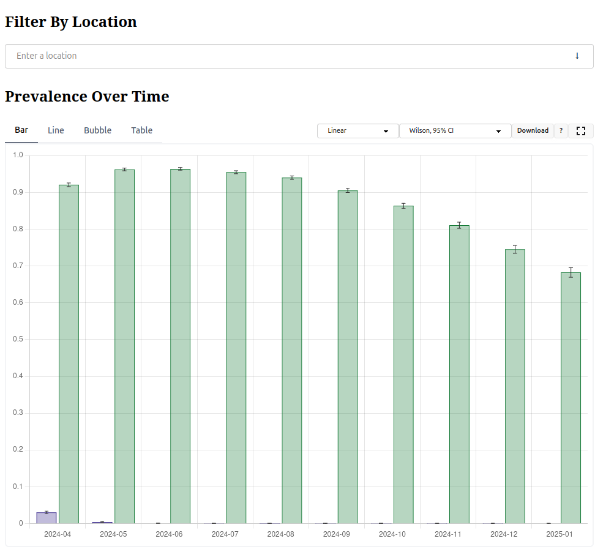

# GenSpectrum Dashboards Components


[](https://www.npmjs.com/package/@genspectrum/dashboard-components)

> This NPM package provides a collection of web components to build interactive dashboards that visualize
> data of a specific instance of [LAPIS](https://github.com/GenSpectrum/LAPIS).

[Documentation](https://components.genspectrum.org/) is available in Storybook.

See https://genspectrum.org/ for a full dashboard that uses these components.

## Installation

```bash
npm i @genspectrum/dashboard-components
```

## Minimal Example

(Note that this does not yet add interactivity between the filter and the graph. Consult the docs for how to achieve that.)

```html
<!DOCTYPE html>
<html lang="en">
<head>
    <script
            type="module"
            src="https://unpkg.com/@genspectrum/dashboard-components@latest/standalone-bundle/dashboard-components.js"
    ></script>
</head>
<body>
    <gs-app lapis="https://lapis.genspectrum.org/open/v2">
        <h2>Filter By Location</h2>
        <gs-location-filter
            fields='["region", "country", "division"]'
            lapisFilter='{ "country": "USA", "dateFrom": "2024-01-01" }'
            value='{ "country": "USA" }'
            width="100%"
            placeholderText="Enter a location"
        ></gs-location-filter>
        <h2>Prevalence Over Time</h2>
        <gs-prevalence-over-time
            numeratorFilters='[{ "displayName": "EG", "lapisFilter": { "country": "USA", "dateFrom": "2024-01-01", "pangoLineage": "EG*" }}, { "displayName": "JN.1", "lapisFilter": { "country": "USA", "dateFrom": "2024-01-01", "pangoLineage": "JN.1*" }}]'
            denominatorFilter='{ "country": "USA", "dateFrom": "2024-01-01" }'
            granularity="month"
            smoothingWindow="7"
            confidenceIntervalMethods='["wilson"]'
            width="100%"
            height="700px"
            lapisDateField="date"
        ></gs-prevalence-over-time>
    </gs-app>
</body>
</html>
```



## Contents

* The code for the components is in [components/](./components). Refer to the [README](./components/README.md) for more information.
* We also provide examples of how to use the components in the [examples](./examples) folder.
